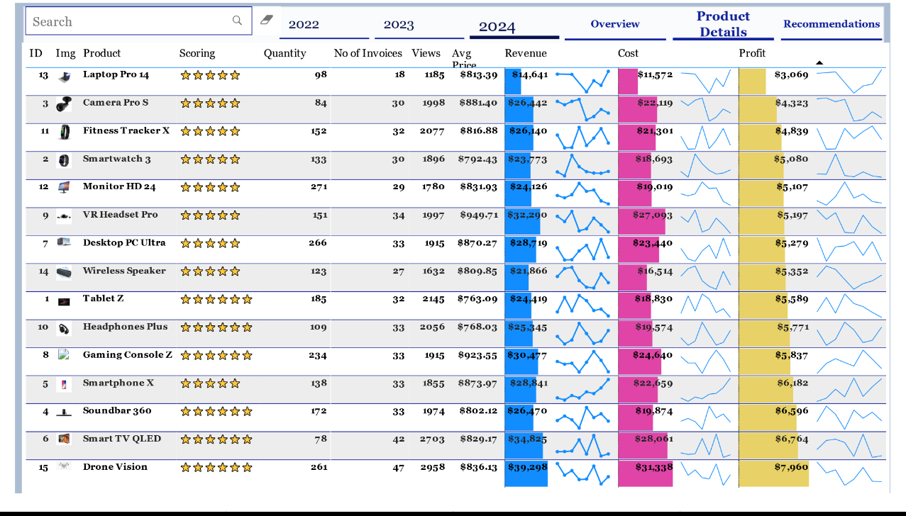

# Electronics-Sales-Dashboard
# 📊 Company Revenue Analysis Dashboard

## 📝 Project Overview

This project provides a detailed analysis of company revenue and related performance indicators across three years — **2022**, **2023**, and **2024**. It examines key business metrics such as **cost**, **profit**, **conversion rates**, and various **revenue breakdowns** by marketing channel, sales channel, lead source, region, and sales representative. The goal is to provide strategic insights and data-driven recommendations for business growth and optimization.

---

## 📅 Yearly Summary

| Year | Revenue ($) | Cost ($) | Profit ($) | Avg Conversion Rate (%) | Total Views |
|------|-------------|----------|------------|--------------------------|-------------|
| 2022 | _[**$587K**]_   | _[**$469K**]_ | _[v**$128K**]_  | _[**17**]_                | _[**44K**]_   |
| 2023 | _[**$625K**]_   | _[**$494K**]_ | _[**$130K**]_  | _[**17**]_                | _[**44K**]_   |
| 2024 | _[**$408K**]_   | _[**$325K**]_ | _[**$83K**]_  | _[**17**]_                | _[**30K**]_   |

---

## 📆 Monthly Revenue Breakdown

| Month      | 2022 Revenue ($) | 2023 Revenue ($) | 2024 Revenue ($) |
|------------|------------------|------------------|------------------|
| January    | _[**$55K**]_        | _[**$57K**]_    |   _[**$55K**]_        |
| February   | _[**$45K**]_        | _[**48K**]_        | _[**$42K**]_        |
| March      | _[**$48K**]_        | _[**51K**]_        | _[**$58K**]_        |
| ...        | ...              | ...              | ...              |
| December   | _[**$45K**]_        | _[**$49K**]_        | _[**NIL**]_        |

---

## 📈 Revenue by Lead Source

| Lead Source         | 2022 ($) | 2023 ($) | 2024 ($) |
|---------------------|----------|----------|----------|
| Email      | _[**$149K**]_ | _[**$144k**]_ | _[**88k**]_ |
| Social Media             | _[**$130k**]_ | _[**$136k**]_ | _[**$85k**]_ |
| Referral     | _[**$122k**]_ | _[**$117k**]_ | _[**84k**]_ |
| Cold Calling        | _[**$102K**]_ | _[**$116k**]_ | _[**$78k**]_ |
| Website           | _[**$94k**]_ | _[**$112k**]_ | _[**$72k**]_ |

## 💼 Revenue by Sales Channel

| Channel     | 2022 ($) | 2023 ($) | 2024 ($) |
|-------------|----------|----------|----------|
| Online      | _[**394k**]_ | _[**$419k**]_ | _[**$279k**]_ |
| In-Store    | _[**$203k**]_ | _[**$205k**]_ | _[**$129k**]_ |
|

---

## 📣 Revenue by Marketing Channel

| Marketing Channel | 2022 ($) | 2023 ($) | 2024 ($) |
|-------------------|----------|----------|----------|
| Spring Promo           | _[**$121k**]_ | _[**$139k**]_ | _[**$93k**]_ |
| Fall Sales        | _[**$124k**]_ | _[**$110k**]_ | _[**$79k**]_ |
| Summer Deals          | _[**$105k**]_ | _[**$128K**]_ | _[**$81k**]_ |
| New Year Campaign       | _[**$114k**]_ | _[**$124k**]_ | _[**$87k**]_ |
| Winter Promo           |  _[**$131k**]_  | __[**$120k**]__  | __[**$66k**]_

---

## 🌍 Revenue by Region

| Region      | 2022 ($) | 2023 ($) | 2024 ($) |
|-------------|----------|----------|----------|
| North America | _[**$12k**]_ | _[**$141k**]_ | _[**$104k**]_ |
| Europe         | _[**$167k**]_ | _[**$167k**]_ | _[**$112k**]_ |
| Asia           | _[**$158k**]_ | _[**$161k**]_ | _[**$104k**]_ |
| South America         | _[**$145k**]_ | _[**$141k**]_ | _[**$88k**]_ |

---

## 👔 Revenue by Sales Rep

| Sales Rep     | 2022 ($) | 2023 ($) | 2024 ($) |
|---------------|----------|----------|----------|
| Bob Martin        | _[**$96K**]_ | _[**$90K**]_ | _[**$64K**]_ |
| Monica Bell         | _[**$82K**]_ | _[**$83K**]_ | _[**$55K**]_ |
| Joey Tribbiani        | _[**$81K**]_ | _[**$80K**]_ | _[**$53K**]_ |
| Rachael Green         | _[**$78K**]_ | _[**$79K**]_ | _[**$53K**]_ |
| Sarah Wilson         | _[**$74K**]_ | _[**$78K**]_ | _[**$53K**]_ |
| Chandler Bing         | _[**$64K**]_ | _[**$72K**]_ | _[**$51K**]_ |
| Alice Johnson         | _[**$64K**]_ | _[**$71K**]_ | _[**$43K**]_ |
| Robert Brown         | _[**$58K**]_ | _[**70K**]_ | _[**$36K**]_ |

---
## Revenue by Country

| **Country**      | **2022 ($)** | **2023 ($)** | **2024 ($)** |
|-----------------|--------------|---------------|--------------|
| France        | _[**$78k**]_ | _[**$82K**]_ | _[**$33K**]_ |
| Brazil        | _[**$82k**]_ | _[**$70K**]_ | _[**$44K**]_ |
| United Kingdom         | _[**$69K**]_ | _[**$79K**]_ | _[**$44K**]_ |
| South Korea         | _**$63K**]_ | _[**$79K**]_ | _[**$46K**]_ |
| Japan         | _[**$77K**]_ | _[**$93K**]_ | _[**$48K**]_ |
| United States        | _[**$76K**]_ | _[**$87K**]_ | _[**$63K**]_ |
| Germany        | _[**$69K**]_ | _[**$68K**]_ | _[**$64K**]_ |
| Canada         | _[**$82K**]_ | _[**$68K**]_ | _[**$66K**]_ |

---
## 📌 Business Recommendations (2022–2024)

1. **📉 Overall Revenue Decline in 2024**
**Observation:**

* Revenue dropped from $625K in 2023 to $408K in 2024, a 35% decline.

* Views also declined from 44K to 30K.

* Conversion rate remained flat at 17%, implying no improvement in funnel efficiency despite lower traffic.

**Recommendation:**

* Boost traffic through targeted ad spend or SEO revamp.

* Evaluate marketing fatigue – experiment with creative refreshes or new campaign channels.

* Consider retargeting past leads who did not convert in 2023–2024.

2. **💸 Reduced Profit Margins in 2024**
**Observation:**

* Profit fell by ~36% from $130K to $83K, aligned with revenue.

* Costs decreased marginally but not proportionately to revenue.

**Recommendation:**

* Audit fixed vs variable costs to cut non-essential expenses.

* Explore automating manual processes (e.g., sales follow-ups, lead scoring).

* Implement tiered pricing models to capture higher margins.

3. **📤 Underperformance in Key Channels**
🧲 **Lead Source Insights:**
* All lead sources saw drops in 2024.

* Email (-40%) and Website (-35%) are particularly alarming.

**Recommendation:**

* Revise email content strategy (personalization, segmentation, A/B testing).

* Optimize website UX and CTAs for conversions.

* Consider chatbots or live agents for high-intent leads.

4 **🛍️ Sales Channel Insights:**
* Online sales declined 33%, though still dominant.

* In-store sales fell by ~37%, potentially from reduced foot traffic or closures.

**Recommendation:**

* Offer omnichannel incentives (e.g., online purchase, in-store pickup).

* Improve cross-channel customer experience with unified CRM tracking.

5. **🌎 Regional Performance**
**Observation:**

* Revenue fell across all regions in 2024.

* Europe and Asia, the historically strongest, saw ~30%+ decline.

* North America dropped from $141K → $104K.

**Recommendation:**

* Deep dive regionally to see if declines are due to macroeconomic factors, local competition, or pricing.

* Consider region-specific campaigns or promotions in underperforming zones.

6. **🧑‍💼 Sales Rep Productivity**
**Observation:**

* All reps saw drops in revenue, with Bob Martin (-33%) and Robert Brown (-49%) among the steepest.

* Average rep output decreased significantly.

**Recommendation:**

* Identify reps with pipeline drop-offs or client churn.

* Consider refresher training, updated incentive structures, or reallocation of territories.

7. **📢 Marketing Channel Shifts**
**Observation:**

* All campaigns declined in 2024, particularly Winter Promo (-49%) and Fall Sales (-36%).

**Recommendation:**

* Analyze channel ROI and reallocate budget to better-performing ones (e.g., Summer Deals).

* Pre-plan campaigns 1–2 quarters in advance with testing calendars.

* Leverage customer feedback to realign promotional timing and messaging.

8. **📍 Country-Specific Trends**
**Observation:**

* France and Brazil had the steepest declines (~50%).

* The U.S. remained relatively resilient.

**Recommendation:**

* Localize campaigns and test market-specific content or offers.

* Consider expanding in higher-growth countries like Germany or Canada based on 2024 stability.

---
